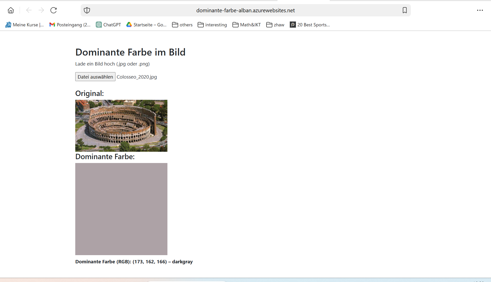
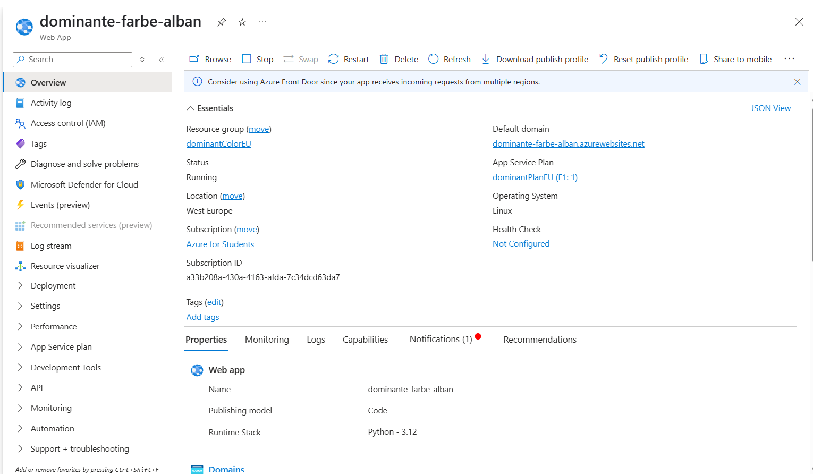
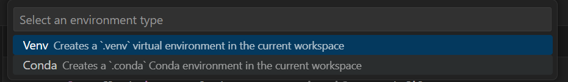
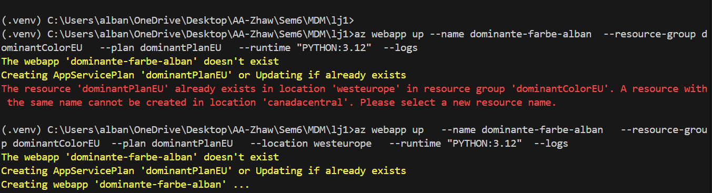

# Lernjournal 1: Web-App zur Bildanalyse mit dominanter Farbe

## Projektziel
Ziel war die Erstellung einer Web-App, die es Nutzerinnen und Nutzern erlaubt, ein Bild hochzuladen. Die Anwendung analysiert serverseitig mit Python (Flask) und Pillow die **dominante Farbe** im Bild und zeigt sie visuell sowie als Farbname (z. B. "brown") an.

## Verwendete Technologien
- **Backend**: Python, Flask
- **Frontend**: HTML, CSS, Vanilla JS, Bootstrap
- **Bildverarbeitung**: Pillow
- **Farbnamen-Erkennung**: Webcolors
- **Deployment**: Azure App Service (Linux, F1-Plan)
- **Dependency Management**: pip-tools mit `requirements.in`

## Repository
**URL**: [https://github.com/albanesi/dominante-farbe-app](https://github.com/albanesi/dominante-farbe-app)

## Projektstruktur (Auszug)
```
bildanalyse-app/
├── app.py
├── requirements.in
├── requirements.txt
├── web/
│   ├── index.html
│   └── script.js
└── .venv/
```

## Funktionsweise
1. Nutzer:in wählt ein Bild im Frontend aus
2. JavaScript sendet das Bild an den `/analyze`-Endpoint
3. Das Backend analysiert das Bild, bestimmt die dominante RGB-Farbe, findet den passenden Farbnamen und gibt JSON zurück
4. Die Farbe wird im Frontend sowohl **visuell (als farbiges Rechteck)** als auch **als Name** angezeigt

## Abhängigkeiten verwalten mit `requirements.in`
Statt `pip freeze` wurde `pip-tools` verwendet:

```bash
pip-compile requirements.in
```

**requirements.in** (händisch gepflegt):
```
flask==3.1.0
pillow==10.3.0
webcolors==1.13
```

Beispielhafte generierte `requirements.txt`:
```txt
flask==3.1.0
itsdangerous==2.2.0
jinja2==3.1.6
markupsafe==3.0.2
pillow==10.3.0
webcolors==1.13
werkzeug==3.1.3
```

## Lokale Tests
Die App wurde lokal über Flask gestartet:
```bash
flask run
```

Aufruf unter: [http://127.0.0.1:5000](http://127.0.0.1:5000)

## Backend Codeauszug
```python
@app.route("/analyze", methods=["POST"])
def analyze():
    image = request.files['image']
    img = Image.open(image.stream).convert("RGB").resize((100, 100))
    colors = img.getcolors(10000)
    dominant = max(colors, key=lambda tup: tup[0])[1]
    color_name = closest_color(dominant)
    return jsonify({
        "dominant_color": dominant,
        "color_name": color_name
    })
```

## Deployment auf Azure
Nach lokalen Tests erfolgte das Deployment via Azure CLI:
```bash
az group create --name dominantColorEU --location westeurope
az appservice plan create --name dominantPlanEU --resource-group dominantColorEU --sku F1 --is-linux
az webapp up --name dominante-farbe-alban --resource-group dominantColorEU --plan dominantPlanEU --location westeurope --runtime "PYTHON:3.12" --logs
```

**Live-App URL:**  
https://dominante-farbe-alban.azurewebsites.net

### 🔵 Azure App UI (Live-Anwendung im Browser)


### 📊 Azure Ressourcenübersicht


## Reflexion
- Ich habe gelernt, wie man eine Flask-App mit klarer Trennung von Backend und Frontend strukturiert
- Die Kombination von `pip-tools`, Azure CLI und GitHub hat mir ein gutes Gefühl für sauberes Deployment vermittelt
- Besonders spannend war es, Farbnamen aus RGB-Werten zu ermitteln (z. B. `(165, 42, 42)` → `brown`)
- Beim nächsten Mal würde ich für produktionsnähere Projekte Gunicorn oder Uvicorn als Server einsetzen


## Weitere technische Details

### ⚙️ Virtuelle Umgebung mit venv
Die Umgebung wurde direkt im Projektordner eingerichtet, um Abhängigkeiten isoliert zu verwalten.



### 🚀 Azure Deployment via CLI
Folgende CLI-Befehle wurden verwendet, um die App erfolgreich online zu deployen:

```bash
az group create --name dominantColorEU --location westeurope
az appservice plan create --name dominantPlanEU --resource-group dominantColorEU --sku F1 --is-linux
az webapp up --name dominante-farbe-alban --resource-group dominantColorEU --plan dominantPlanEU --location westeurope --runtime "PYTHON:3.12" --logs
```

